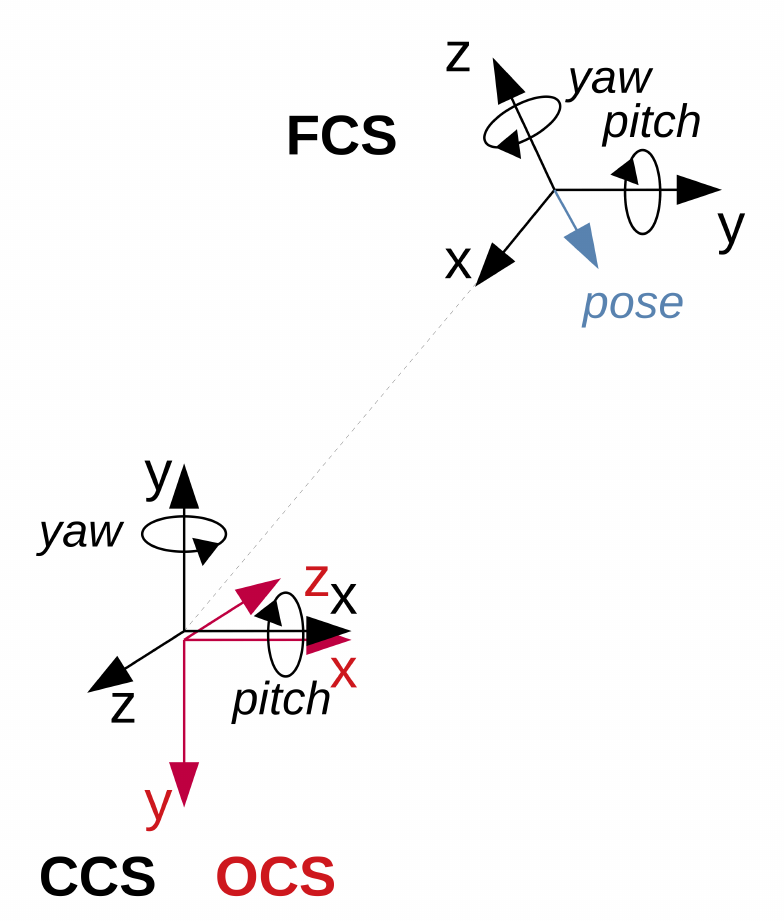

# VFOA Module

This package contains several models that allow to estimate the vfoa (visual focus of attention) of a subject given
his gaze and the position of the potential visual targets (some models require additional variables, like
head position and orientation, speaking status, ...). It provides also an handler class VfoaModule, that make the link
between the user and those models.

### Prerequisites

- Numpy 1.14.0

## Installing

Simply install the package using
```bash
python setup.py install
```
Add the --record installed_files.txt option to get the list of installed files

## Usage

To use this module, import it and instantiate it using the following code. The implementation will look like this:

```python
from vfoa.vfoa_module import VFOAModule, Person, Target
vfoaModule = VFOAModule(modelName)

def get_vfoa(subject, targetList, frameIndex):
    """ Return probabilities that <subject> looks at each target in <targetList> """
    headpose = [subject.headpose.x, subject.headpose.y, subject.headpose.z, 
                subject.headpose.yaw, subject.headpose.pitch, subject.headpose.roll]
    gaze = [subject.gaze.x, subject.gaze.y, subject.gaze.z, 
                subject.gaze.yaw, subject.gaze.pitch, subject.gaze.roll]
    bodypose = [subject.bodypose.x, subject.bodypose.y, subject.bodypose.z, 
                subject.bodypose.yaw, subject.bodypose.pitch, subject.bodypose.roll]
    speaking = subject.isSpeaking
    personDict = {subject.name: Person(subject.name, headpose, gaze, bodypose, speaking)}
    
    targetDict = {}
    for target in targetList:
        position = [target.position.x, target.position.y, target.position.z]
        targetDict[target.name] = Target(target.name, position)
    
    vfoaModule.compute_vfoa(personDict, targetDict, frameIndex)
    return vfoaModule.get_vfoa_best(subject.name)
```

You should provide a valid *modelName* (list is given here below)
Please note that some methods can ignore some cues, like gaze or bodypose and return a different format of VFOA.
See below for methods description.

#### 1) geometricalModel
Estimate vfoa based on a geometric model: if the angular distance between the gaze vector and the target
direction (i.e. line frome eye to target) is below a given threshold, the gaze is allocated to this target.
If several targets fill this condition, the nearest to the gaze vector wins.

Needed inputs: **gaze direction**

Ouput: dictionary of {targetName: isVFOA}, i.e. sort of one-hot encoding

Note: you can also use this model without knowing the gaze by making the approximation that the gaze is equal to the headpose


#### 2) gazeProbability
Estimate vfoa based on the probability that the subject is looking in the target direction. It means that
we want to compute the posterior probability of the gaze and evaluate it at each target position.
Thus, output probabilities does not sum to 1, as they are only point-wise evaluation of the posterior.

Needed inputs: **headpose** and **gaze direction**

Ouput: dictionary of {targetName: probability}. Note that it is not normalized and aversion is constant

Note: you can also use this model without knowing the gaze by making the approximation that the gaze is equal to the headpose


#### 3) gaussianModel
Estimate vfoa based on a gaussian model: each target is modelled as a gaussian centered on the target and with
a given variance. The aversion is also modelled as a gaussian centered on the head pose of the subject, with
another given variance. Finally, measure noise is added to each gaussian, and it compute the likelihood of
the observed gaze wrt each target. The final probabilities are normalized and returned, giving the probability
that the subject looks at each target

Needed inputs: **headpose** (optional) and **gaze direction**

Ouput: dictionary of {targetName: probability}, a normalized distribution.

Note: you can also use this model without knowing the gaze by making the approximation that the gaze is equal to the headpose


#### 4) HMM
Estimate vfoa based on a HMM. Gaze is estimated from the head pose using either the Midline effect model or the dynamical
head reference model.

Needed inputs: **headpose**

Ouput: dictionary of {targetName: probability}, a normalized distribution.


## About coordinate systems
Depending on the method, different coordinate systems (CS) are used. In order to make it easy to use,
used coordinate system must be defined when a Person or a Target obejct is created. Here is the
list of possible CS:

CS for positions in 3D space (positionCS):
* Camera Coordinate System (CCS): this CS is attached to the camera. The z-axis goes backward (on
the optical axis), the y-axis goes upward and x-axis goes to right when one looks in the same
direction as the camera.
* Optical Coordinate System (OCS): this CS corresponds to the openCV frame, i.e. the x-axis goes to
right in the image frame, the y-axis goes downward in the image frame and the z-axis goes forward
and is aligned to the optical axis)

CS for poses in 3d space (poseCS):
* Camera Coordinate System (CCS): this CS is attached to the camera. The z-axis goes backward (on
the optical axis), the y-axis goes upward and x-axis goes to right when one looks in the same
direction as the camera. Angles are defined as follow: yaw is the positive rotation over y, pitch is
the negative rotation over x and roll is the rotation over z
* Frontal Coordinate System (FCS): this CS is attached to the head of a person and is oriented
toward the camera. It means that it is dependent on the person and on the time. The x-axis points
toward the camera, the z-axis goes upward and the y-axis goes to the right when one is in front of
the person. Angles are defined as follow: yaw is the negative rotation over z, pitch is the negative
rotation over y and roll is the negative rotation over x



*Example for CCS*: Let's define a setup with a subject in front of a camera. We define a coordinate
system attached to the camera, with x-axis on the right, y-axis up and z-axis backward (from the
camera point of view). If the subject is in the center of the image, standing at 1 meter from the
camera, he's xyz position will be (0, 0, -1). Now we can define the gaze angles:
* if he is looking at the camera, the gaze direction yaw-pitch-roll will be (0, 0, 0);
* if he looks 45 degrees up, it will become (0, 45, 0);
* if he looks 45 degrees on the right, it will become (-45, 0, 0);
* etc

### Other coordinate systems
You can work with another coordinate system, as long it is fixed over time (FCS is a special case
that requires particuler management). To do so, set positionCS and poseCS to 'CCS', and methods
should work normally.

## Examples

...

## License

This project is licensed under the BSDv3 License - see the [LICENSE](LICENSE) file for details

Copyright (c) 2018, Idiap Research Institute
Author: Remy Siegfried (remy.siegfried@idiap.ch)
